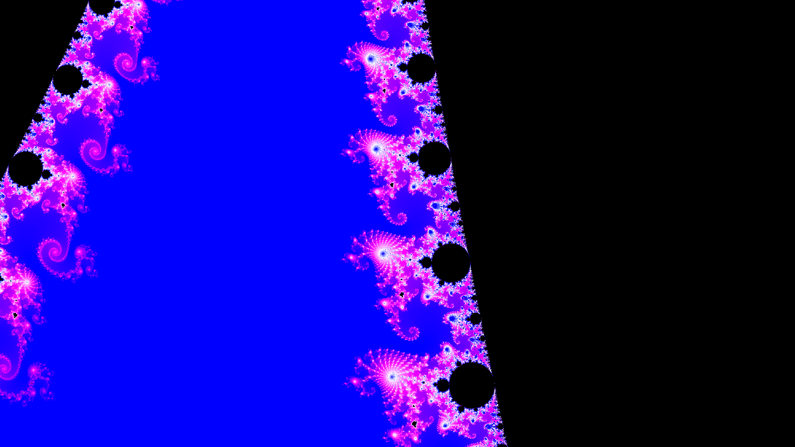
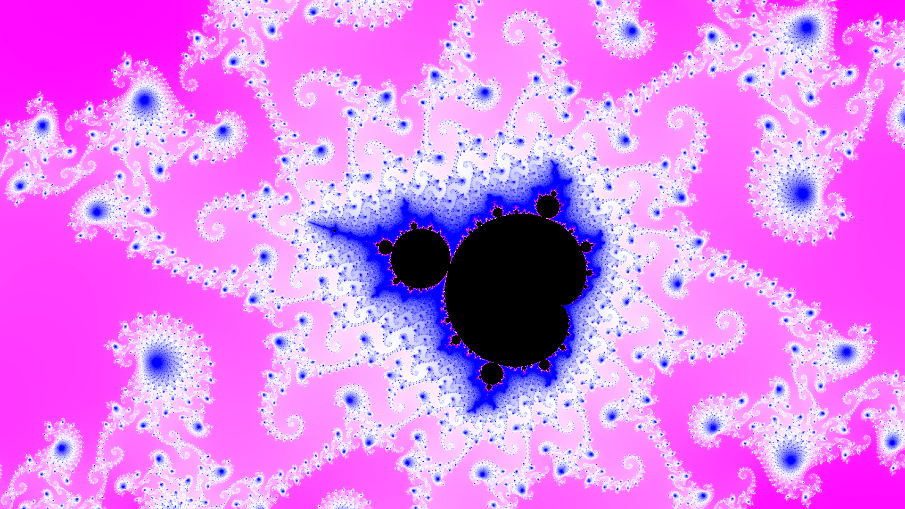

# Mandelbrot Zoom
Program to generate a visualization of the mandelbrot set, written in C++.






# How to build
This project uses cmake as its build system. To download and build, use the following commands:
```bash
git clone https://github.com/thomasevan2003/mandelbrot-zoom.git
cd mandelbrot-zoom
mkdir build
cd build
cmake ..
cmake --build .
```

# How to use
For this project, the compute process is split into two steps. First, run the compute-set executable, which will compute a map of the iteration count for each zoom level at high resolution. For a maximum zoom level of 2^n, there will be n maps generated. Maps of the mandelbrot set will be placed in the base-output directory. Next, run generate-frames, which will interpolate lower resolution sets from the computed maps and produce the output images of the Mandelbrot zoom. The final video frames will be placed in the frames directory. The video file can be generated from these frames using tools such as ffmpeg.

# dependencies
This project uses stb_image_write for image saving (already included in this repository).